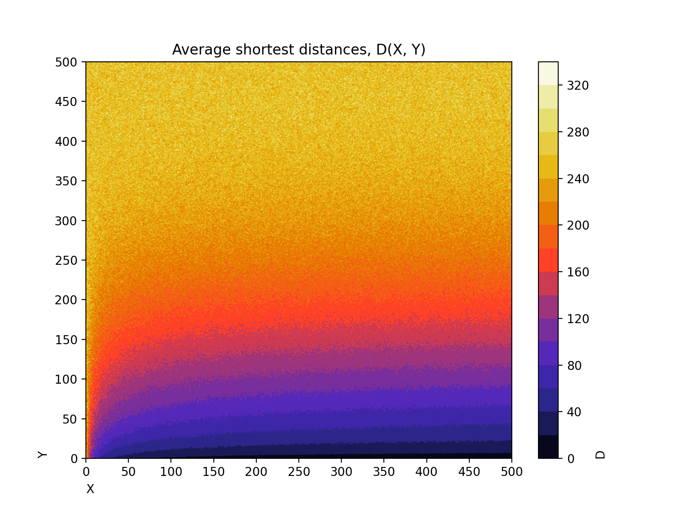
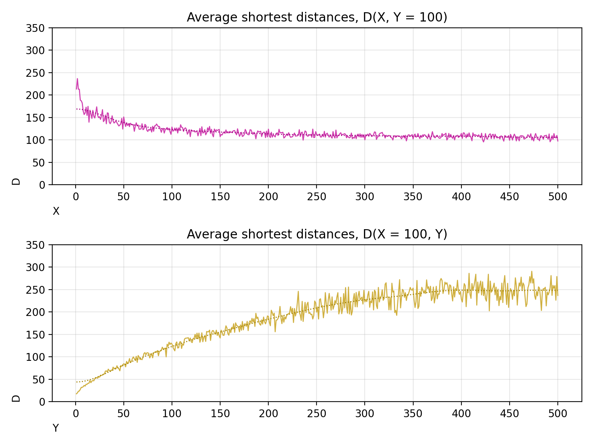
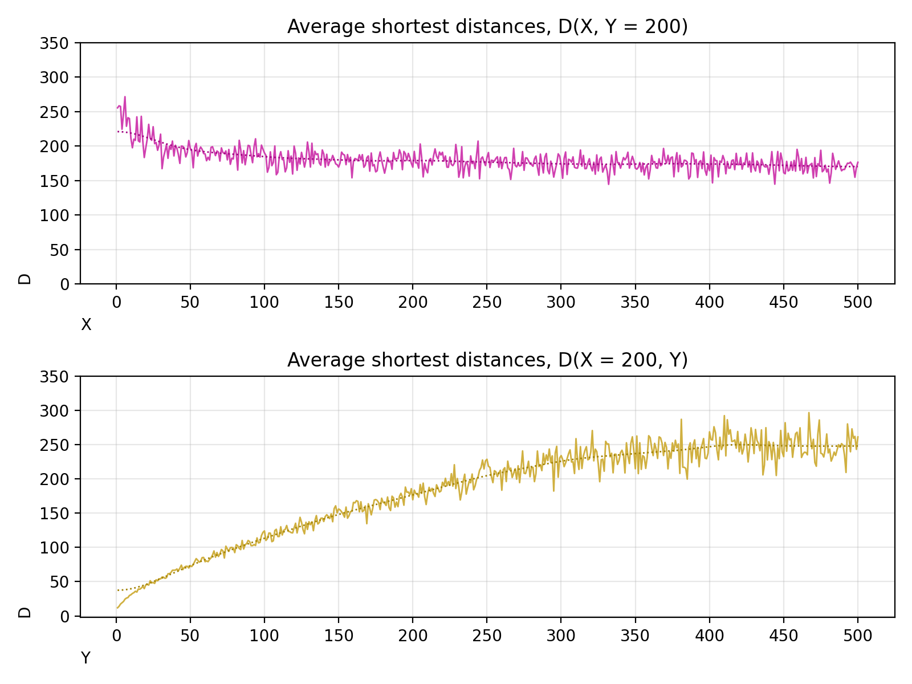

# 標題：「小世界網路」的性質及不同資料結構實現的戴克斯特拉演算法比較

## 目的

本次實驗的目的如標題所示。

## 背景

本次實驗會提到「小世界網路模型」、「求最短路徑演算法」、「優先佇列的實作比較」。

1. 小世界網絡（Small World Network）是一種網路模型，其中大多數節點不是彼此的鄰近點，但大致上可以通過少量的步數到達彼此。

2. 求最短路徑演算法採用戴克斯特拉演算法（Dijkstra's Single Source Shortest Paths Algorithm, Dijkstra's SSSP Algorithm）取得在圖上從單一源點出發到任意目的點的路徑，其中結果包含路徑上的所有邊（All previous edges）以及路徑長（Distance）。

3. 優先佇列（Priority Queue）是求最短路徑演算法中常用的資料結構，用於維護每個節點的最短路徑值。不同實現方式有不同優缺點，通常為了執行效率，實作上會採用堆（Heap），查找和更新時間較低。

## 方法

1. 本次實驗如何建立小世界網路模型？
已知 1000 個節點，給每個節點編號 0～999，將節點 i 和節點 (i + 1) % 1000 連線，組成一個含 1000 條邊的環（Cycle），每條邊長度為 1，取 X 組任意節點產生新的額外邊其長度皆為 Y，其中 X 與 Y 範圍皆為整數的 1～500 [附錄 1]。

![圖一、X 為 100 的小世界網路視覺圖 [附錄 2]](../output/graph_view.svg)

2. 本次實驗如何利用求最短路徑演算法？
為了研究小世界網路的特點，知道任意兩點之間的最短路徑長（Shortest path distance），也就是任意兩點距離（Distance）是必要的。本次實驗將觀察節點數、邊數與邊長度，對於平均兩點距離（Average distance）的關係。依照中央極限定理（Central Limit Theorem）對於任何 X 及 Y，皆抽樣 Z = 50 組點對（每一組點對包含 1 起點與 1 終點），紀錄平均兩點距離 D 為此 50 組點對之間的距離之算數平均數，每筆資料皆為一組 X, Y, D 記錄在 `output/distances.csv` [附錄 3]。

3. 本次實驗如何實作戴克斯特拉演算法？
參考 Nil Mamano 的建議 [附錄 4] 以及 Boost Graph Library 中對於 dijkstra_shortest_paths 的實作說明 [附錄 5]，本報告作者以 C++11 規範自行寫出可用的函式 [附錄 6]。

4. 本次實驗如何比較不同資料結構實現的戴克斯特拉演算法？
在 [方法 3] 中已提到本次實驗的戴克斯特拉演算法實作，`sssp` 函式，它採用泛型編程，可以在編譯期時決定底層之資料結構，支援 `std::priority_queue`、`__gnu_pbds::priority_queue`，其中 `__gnu_pbds::priority_queue` 是由 GNU Policy-based Data Structure Library 所提供，可以選擇五種資料結構之一作為優先佇列的實作：Binary Heap、Binomial Heap、Pairing Heap、Redundant-counter Binomial Heap、Thin Heap [附錄 7]。本次實驗只會討論兩種資料結構實作的戴克斯特拉算法：二元堆（Binary Heap）[附錄 8] 和配對堆（Pairing Heap）[附錄 9]，比較項目只有執行時間，利用 `chrono`（C++ Standard Library）自行寫出計時器，測量程式片段執行時間 [附錄 10]。

5. 本次實驗如何比較不同優先佇列的實作？
承接 [方法 4]，本次實驗會討論並測量兩種資料結構：二元堆和配對堆，在新增（push）和刪除最小元素（pop）的實際執行速度。其中二元堆（Binary Heap）是 `std::priority_queue<Tp, std::vector<Tp>, std::greater<Tp>>`，配對堆（Pairing Heap）是 `__gnu_pbds::priority_queue<Tp, std::greater<Tp>, __gnu_pbds::pairing_heap_tag>`，`Tp` 皆為 `part_edge_type`，為 `std::pair<uint32_t, uint32_t>` 的衍生類。

## 發現

1. 當額外邊數量（X）增加，就能使平均兩點距離（D）從 250 左右縮減到一個區間內的數值，且該數值與 Y 正相關。X 與 D 負相關。

2. 當額外邊數量（X）足夠多（約大於 100），在額外邊長度（Y）約小於 150 時，平均兩點距離（D）通常大於 Y，而 Y 約大於 150 時，D 通常小於 Y，而且 D 的誤差會在 Y 約大於 200 以後增加。

3. 當額外邊長度（Y）增加，平均兩點距離（D）也會增加。即使 Y 大於 250，平均兩點距離（D）還是在 250 左右。Y 與 D 正相關。

4. 在戴克斯特拉演算法（Dijkstra's SSSP Algorithm）中，對於整數對資料，使用 Binary Heap（std_priority_queue）比使用 Pairing Heap（gnu_pbds_pairing_heap）快。

其餘結果在 [附錄 11] 可找到。

## 解釋

[發現 1] 代表本實驗展示了小世界網路的一個重要屬性：即使每個節點沒有太多的鄰近點（1 個節點平均邊數最大 1.5），大多數的任意兩點的距離都足夠小。

[發現 2] 代表如果額外邊長度（Y）過長，它對平均兩點距離（D）的影響會減弱，由 D 的誤差隨著 Y 變大而變大可知。

[發現 3] 表示平均兩點距離（D）有個限制，若額外邊數量（X）為 0，可知 D 約為 250（`D = (2 * 499 * (1 + 499) / 2 + 500) / 999`），這也就是為什麼 [發現 1] 「額外邊數量（X）增加，就能使平均兩點距離（D）從 250 左右縮減」。

[發現 4] 依照 Data Locality，Binary Heap 採用陣列結構，會比 Pairing Heap 的節點結構快。

## 附錄

1. test/distances.cpp
2. test/graph_view.cpp
3. output/distances.csv
4. [Dijkstra's algorithm introduction](http://nmamano.com/blog/dijkstra/dijkstra.html)
5. [Boost Graph Library dijkstra_shortest_paths](https://www.boost.org/doc/libs/1_42_0/libs/graph/doc/dijkstra_shortest_paths.html)
6. src/graph/sssp.hpp
7. [GNU PBDS Priority-Queue design](https://gcc.gnu.org/onlinedocs/libstdc++/ext/pb_ds/pq_design.html)
8. [std::priority_queue](https://gcc.gnu.org/onlinedocs/gcc-12.2.0/libstdc++/api/a08762.html)
9. [GNU PBDS pairing heap](https://gcc.gnu.org/onlinedocs/gcc-12.2.0/libstdc++/api/a13550.html)
10. src/tool/timer.hpp, [std::chrono](https://gcc.gnu.org/onlinedocs/gcc-12.2.0/libstdc++/api/a01672.html)
11. output
12. 檔案架構在 README.md，src 是所用原始碼的目錄，debug 是測試檔案的目錄，output 是結果目錄，編輯紀錄都在 .git 可以瀏覽。
13. 環境是 MacOS 10.15 & GCC 12.2.0 Homebrew & Python 3.10 & ZSH

## 參考

1. [XML Format](https://developer.mozilla.org/en-US/docs/Web/XML)
2. [SVG Format](https://developer.mozilla.org/en-US/docs/Web/SVG)
3. [std::chrono](https://gcc.gnu.org/onlinedocs/gcc-12.2.0/libstdc++/api/a01672.html)
4. [std::complex](https://gcc.gnu.org/onlinedocs/gcc-12.2.0/libstdc++/api/a01572.html)
5. [std::unordered_map](https://gcc.gnu.org/onlinedocs/gcc-12.2.0/libstdc++/api/a08926.html)
6. [std::priority_queue](https://gcc.gnu.org/onlinedocs/gcc-12.2.0/libstdc++/api/a08762.html)
7. [GNU PBDS Priority-Queue design](https://gcc.gnu.org/onlinedocs/libstdc++/ext/pb_ds/pq_design.html)
8. [GNU PBDS pairing heap](https://gcc.gnu.org/onlinedocs/gcc-12.2.0/libstdc++/api/a13550.html)
9. [__gnu_pbds::priority_queue](https://gcc.gnu.org/onlinedocs/gcc-12.2.0/libstdc++/api/a12902.html)
10. [Dijkstra's algorithm introduction](http://nmamano.com/blog/dijkstra/dijkstra.html)
11. [Dijkstra's algorithm on a undirected graph](https://www.geeksforgeeks.org/dijkstras-shortest-path-algorithm-using-priority_queue-stl/)
12. [Boost Graph Library dijkstra_shortest_paths](https://www.boost.org/doc/libs/1_42_0/libs/graph/doc/dijkstra_shortest_paths.html)
13. [Boost Graph Library Github](https://github.com/boostorg/graph)
14. [Boost Graph Library Dijkstra's SSSP algorithm example](https://github.com/boostorg/graph/blob/develop/example/dijkstra-example.cpp)
15. [NumPy](https://numpy.org/doc/stable/reference)
16. [Matplotlib](https://matplotlib.org/stable)
17. [Pandas](https://pandas.pydata.org/docs/reference)
18. [Small World Network Presentation](https://www.jsums.edu/nmeghanathan/files/2015/08/CSC641-Fall2015-Module-6-Small-World-Networks-reduced.pdf)
19. [Small World Network](https://en.wikipedia.org/wiki/Small-world_network)
