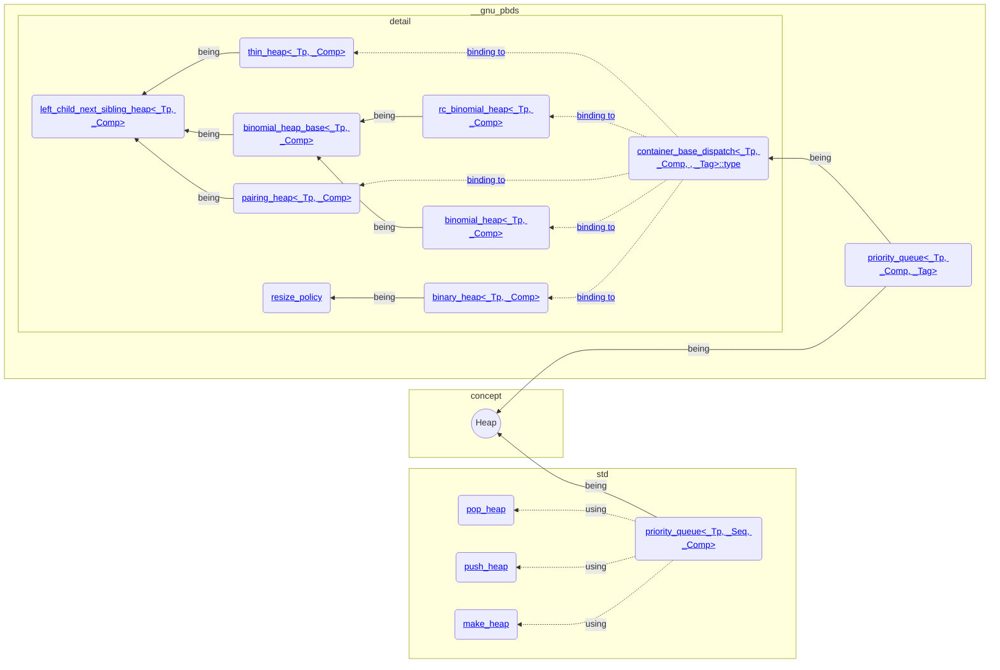

# Priority Queue

```mermaid
graph RL;
subgraph concept
  heap((Heap));
end

spq(<a href=https://gcc.gnu.org/onlinedocs/gcc-12.2.0/libstdc++/api/a08762.html>priority_queue<_Tp, _Seq, _Comp></a>);
make(<a href=https://gcc.gnu.org/onlinedocs/gcc-12.2.0/libstdc++/api/a01614.html#ga2a685c934e85086e5ac372026e8064f6>make_heap</a>);
push(<a href=https://gcc.gnu.org/onlinedocs/gcc-12.2.0/libstdc++/api/a01614.html#gab628ce505c9574f8929a0fa49ed514b3>push_heap</a>);
pop(<a href=https://gcc.gnu.org/onlinedocs/gcc-12.2.0/libstdc++/api/a01614.html#ga0a57ba46981d46e0f3ebd4703d0ad18b>pop_heap);

binhp(<a href=https://gcc.gnu.org/onlinedocs/gcc-12.2.0/libstdc++/api/a13278.html>binary_heap<_Tp, _Comp></a>);
bimhp(<a href=https://gcc.gnu.org/onlinedocs/gcc-12.2.0/libstdc++/api/a13326.html>binomial_heap<_Tp, _Comp></a>);
pahp(<a href=https://gcc.gnu.org/onlinedocs/gcc-12.2.0/libstdc++/api/a13550.html>pairing_heap<_Tp, _Comp></a>);
rbimhp(<a href=https://gcc.gnu.org/onlinedocs/gcc-12.2.0/libstdc++/api/a13654.html>rc_binomial_heap<_Tp, _Comp></a>);
thinhp(<a href=https://gcc.gnu.org/onlinedocs/gcc-12.2.0/libstdc++/api/a13702.html>thin_heap<_Tp, _Comp></a>);

gpq(<a href=https://gcc.gnu.org/onlinedocs/gcc-12.2.0/libstdc++/api/a12902.html>priority_queue<_Tp, _Comp, _Tag></a>);
gcbdtp(<a href=https://gcc.gnu.org/onlinedocs/gcc-12.2.0/libstdc++/api/a13070.html>container_base_dispatch<_Tp, _Comp, , _Tag>::type</a>);
lcnsh(<a href=https://gcc.gnu.org/onlinedocs/gcc-12.2.0/libstdc++/api/a13482.html>left_child_next_sibling_heap<_Tp, _Comp></a>);
rzplc(<a href=https://gcc.gnu.org/onlinedocs/gcc-12.2.0/libstdc++/api/a13322.html>resize_policy</a>);
bimhpb(<a href=https://gcc.gnu.org/onlinedocs/gcc-12.2.0/libstdc++/api/a13330.html>binomial_heap_base<_Tp, _Comp></a>);

subgraph std
  spq .->|using| make;
  spq .->|using| push;
  spq .->|using| pop;
  spq -->|being| heap;
end

subgraph __gnu_pbds
  gpq --->|being| heap;
  gpq -->|being| gcbdtp;

  subgraph detail
    gcbdtp .->|<a href=https://gcc.gnu.org/onlinedocs/gcc-12.2.0/libstdc++/api/a13162.html#adbbd8131d9a4cdc53e280a34f161dd3c>binding to</a>| binhp;
    gcbdtp .->|<a href=https://gcc.gnu.org/onlinedocs/gcc-12.2.0/libstdc++/api/a13154.html#ab4cecfd9b1ed21229fe049cabebe321c>binding to</a>| bimhp;
    gcbdtp .->|<a href=https://gcc.gnu.org/onlinedocs/gcc-12.2.0/libstdc++/api/a13150.html#adecf3a56bd35a5ca376d0492e7123a7b>binding to</a>| pahp;
    gcbdtp .->|<a href=https://gcc.gnu.org/onlinedocs/gcc-12.2.0/libstdc++/api/a13158.html#a7d1df51ac2b0c2e893e450bf7fe9e379>binding to</a>| rbimhp;
    gcbdtp .->|<a href=https://gcc.gnu.org/onlinedocs/gcc-12.2.0/libstdc++/api/a13166.html#a9810405868a4fa2e115def4f7da71b66>binding to</a>| thinhp;

    binhp -->|being| rzplc;
    bimhpb -->|being| lcnsh;
    bimhp -->|being| bimhpb;
    rbimhp -->|being| bimhpb;
    pahp --> |being| lcnsh;
    thinhp -->|being| lcnsh;
  end
end
```

