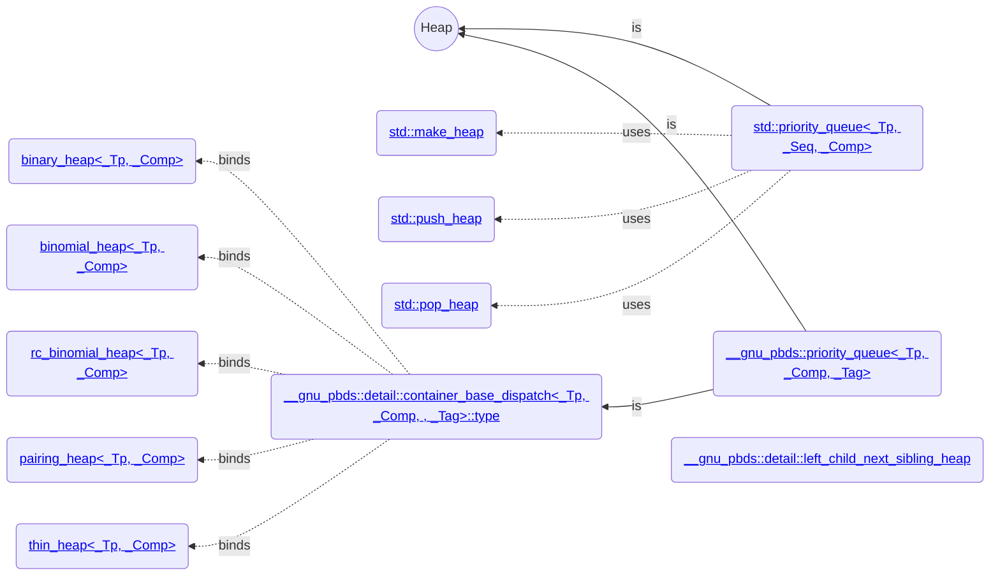

# Priority Queue

```mermaid
graph RL;
heap((Heap));
spq(<a href=https://gcc.gnu.org/onlinedocs/gcc-12.2.0/libstdc++/api/a08762.html>std::priority_queue<_Tp, _Seq, _Comp></a>);
make(<a href=https://gcc.gnu.org/onlinedocs/gcc-12.2.0/libstdc++/api/a01614.html#ga2a685c934e85086e5ac372026e8064f6>std::make_heap</a>);
push(<a href=https://gcc.gnu.org/onlinedocs/gcc-12.2.0/libstdc++/api/a01614.html#gab628ce505c9574f8929a0fa49ed514b3>std::push_heap</a>);
pop(<a href=https://gcc.gnu.org/onlinedocs/gcc-12.2.0/libstdc++/api/a01614.html#ga0a57ba46981d46e0f3ebd4703d0ad18b>std::pop_heap);

binhp(<a href=https://gcc.gnu.org/onlinedocs/gcc-12.2.0/libstdc++/api/a13278.html>binary_heap<_Tp, _Comp></a>);
bimhp(<a href=https://gcc.gnu.org/onlinedocs/gcc-12.2.0/libstdc++/api/a13326.html>binomial_heap<_Tp, _Comp></a>);
pahp(<a href=https://gcc.gnu.org/onlinedocs/gcc-12.2.0/libstdc++/api/a13550.html>pairing_heap<_Tp, _Comp></a>);
rbimhp(<a href=https://gcc.gnu.org/onlinedocs/gcc-12.2.0/libstdc++/api/a13654.html>rc_binomial_heap<_Tp, _Comp></a>);
thinhp(<a href=https://gcc.gnu.org/onlinedocs/gcc-12.2.0/libstdc++/api/a13702.html>thin_heap<_Tp, _Comp></a>);

gpq(<a href=https://gcc.gnu.org/onlinedocs/gcc-12.2.0/libstdc++/api/a12902.html>__gnu_pbds::priority_queue<_Tp, _Comp, _Tag></a>);
gcbd(<a href=https://gcc.gnu.org/onlinedocs/gcc-12.2.0/libstdc++/api/a13070.html>__gnu_pbds::detail::container_base_dispatch<_Tp, _Comp, , _Tag>::type</a>);
lcnsh(<a href=https://gcc.gnu.org/onlinedocs/gcc-12.2.0/libstdc++/api/a13482.html>__gnu_pbds::detail::left_child_next_sibling_heap</a>);

spq -->|is| heap;
gpq -->|is| heap;

spq .->|uses| make;
spq .->|uses| push;
spq .->|uses| pop;

gpq -->|is| gcbd;

gcbd .->|binds| binhp
gcbd .->|binds| bimhp
gcbd .->|binds| rbimhp
gcbd .->|binds| pahp
gcbd .->|binds| thinhp
```

