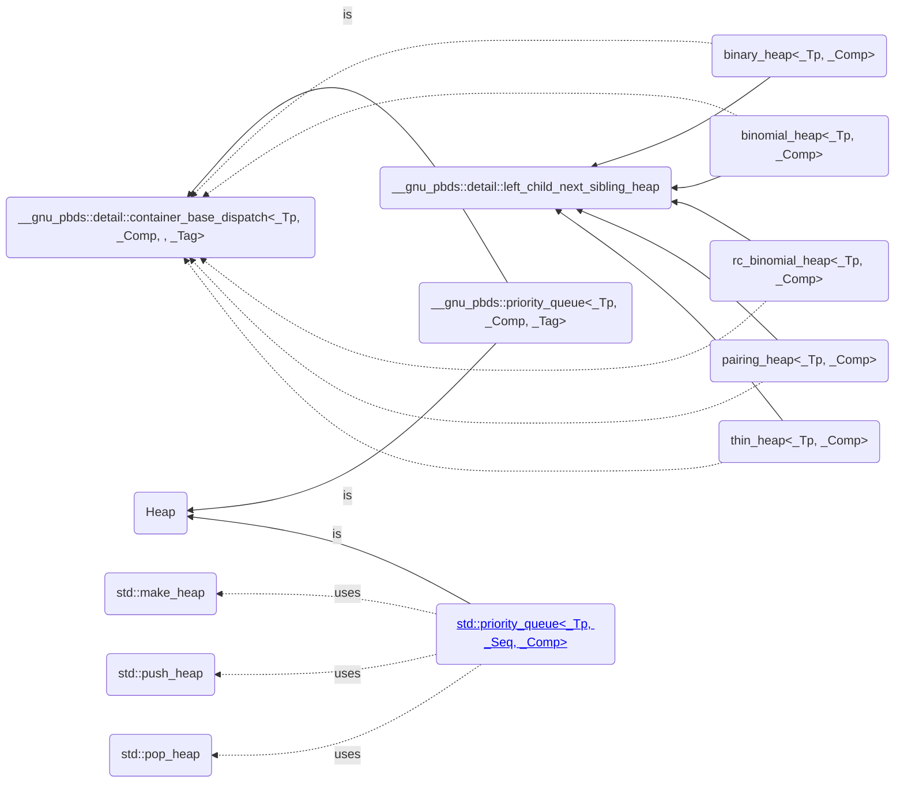

# Priority Queue

```mermaid
graph RL;
heap(Heap);
gpq(__gnu_pbds::priority_queue<_Tp, _Comp, _Tag>);
spq(<a href="https://gcc.gnu.org/onlinedocs/gcc-12.2.0/libstdc++/api/a08762.html">std::priority_queue<_Tp, _Seq, _Comp></a>);
make(std::make_heap);
push(std::push_heap);
pop(std::pop_heap);
binhp(binary_heap<_Tp, _Comp>);
bimhp(binomial_heap<_Tp, _Comp>);
pahp(pairing_heap<_Tp, _Comp>);
rbimhp(rc_binomial_heap<_Tp, _Comp>);
thinhp(thin_heap<_Tp, _Comp>);
gcbase(__gnu_pbds::detail::container_base_dispatch<_Tp, _Comp, , _Tag>);
lcnsh(__gnu_pbds::detail::left_child_next_sibling_heap);

gpq -->|is| heap;
spq -->|is| heap;

spq .->|uses| make;
spq .->|uses| push;
spq .->|uses| pop;

gpq -->|is| gcbase;
binhp ..-> gcbase;
binhp --> lcnsh;
bimhp ..-> gcbase;
bimhp --> lcnsh;
rbimhp ..-> gcbase;
rbimhp --> lcnsh;
pahp ..-> gcbase;
pahp --> lcnsh;
thinhp ..-> gcbase;
thinhp --> lcnsh;

click spq "https://gcc.gnu.org/onlinedocs/gcc-12.2.0/libstdc++/api/a08762.html";
click make "https://gcc.gnu.org/onlinedocs/gcc-12.2.0/libstdc++/api/a01614.html#ga2a685c934e85086e5ac372026e8064f6";
click push "https://gcc.gnu.org/onlinedocs/gcc-12.2.0/libstdc++/api/a01614.html#ga0a57ba46981d46e0f3ebd4703d0ad18b";
click pop "https://gcc.gnu.org/onlinedocs/gcc-12.2.0/libstdc++/api/a01614.html#gab628ce505c9574f8929a0fa49ed514b3";
click gpq "https://gcc.gnu.org/onlinedocs/gcc-12.2.0/libstdc++/api/a12902.html";
click gcbase "https://gcc.gnu.org/onlinedocs/gcc-12.2.0/libstdc++/api/a13070.html";
click lcnsh "https://gcc.gnu.org/onlinedocs/gcc-12.2.0/libstdc++/api/a13482.html";
click binhp "https://gcc.gnu.org/onlinedocs/gcc-12.2.0/libstdc++/api/a13654.html";
click bimhp "https://gcc.gnu.org/onlinedocs/gcc-12.2.0/libstdc++/api/a13326.html";
click rbimhp "https://gcc.gnu.org/onlinedocs/gcc-12.2.0/libstdc++/api/a13654.html";
click pahp "https://gcc.gnu.org/onlinedocs/gcc-12.2.0/libstdc++/api/a13550.html";
click thinhp "https://gcc.gnu.org/onlinedocs/gcc-12.2.0/libstdc++/api/a13702.html";

```

