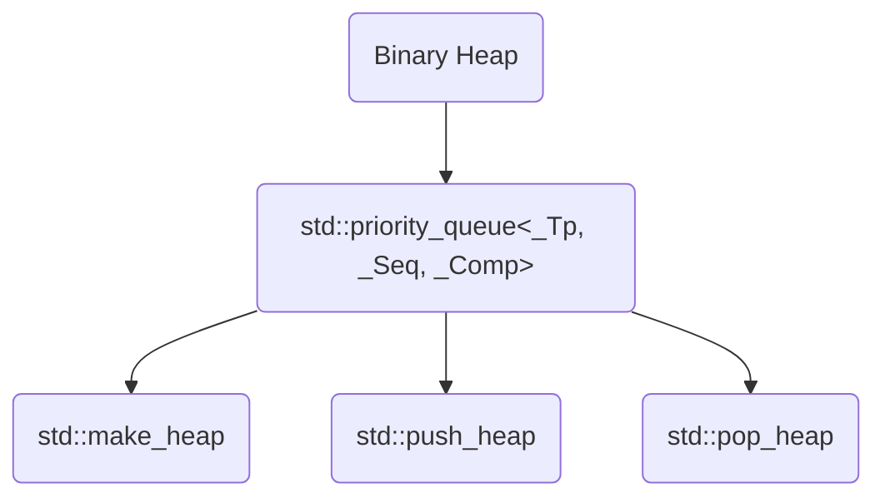

# Priority Queue

```mermaid
graph TD;
binhp(Binary Heap);
spq(std::priority_queue<_Tp, _Seq, _Comp>);
make(std::make_heap);
push(std::push_heap);
pop(std::pop_heap);
click spq "https://gcc.gnu.org/onlinedocs/gcc-12.2.0/libstdc++/api/a08762.html";
click make "https://gcc.gnu.org/onlinedocs/gcc-12.2.0/libstdc++/api/a01614.html#ga2a685c934e85086e5ac372026e8064f6";
click push "https://gcc.gnu.org/onlinedocs/gcc-12.2.0/libstdc++/api/a01614.html#ga0a57ba46981d46e0f3ebd4703d0ad18b";
click pop "https://gcc.gnu.org/onlinedocs/gcc-12.2.0/libstdc++/api/a01614.html#gab628ce505c9574f8929a0fa49ed514b3";
binhp --> spq;
spq --> make;
spq --> push;
spq --> pop;
```

